# BC Cash Flow Forecasting User Guide

## 1. Overview

Cash flow forecasting in BlueCollar answers one question: what will money look like for our construction projects over the next several months, and how does that change as the work moves?

It lives entirely inside NetSuite. No external dashboards to log into, no spreadsheets to refresh by hand. The forecast is built from the documents you already work with (Sales Orders, Purchase Orders, Change Requests), and surfaces in the places your team already opens.

### Who uses it

- **Project Managers** open the Cash Flow subtab on their project record to see how the job is pacing financially, and to maintain the schedule that drives the forecast.
- **Financial Controllers** use the Portfolio view to roll every project up into a single company-wide picture. Slice by Customer, PM, or Subsidiary when accounting needs a narrower cut.
- **Project Executives** check both: the headline portfolio number, then drill into the projects that matter for the week.

### The five surfaces

| Surface | Where it lives | What it shows |
|---|---|---|
| **PO schedule editor** | Cash Flow subtab on Purchase Orders | Cost timing for a single PO |
| **SO schedule editor** | Cash Flow subtab on Sales Orders | Revenue timing for a single contract |
| **CR schedule editor** | Cash Flow subtab on Change Requests | Change-order timing (contract and estimate) |
| **Per-project reports** | Cash Flow subtab on the BC Project record (Combined / Cost / Revenue children) | Single project's forecast, three angles |
| **Portfolio Cash Flow** | BlueCollar → Project Control Center → Cash Flow Portfolio | Every BC project, rolled up, with filters |

### Universal controls

A few controls work the same on every report surface:

- **Cash / Accrual basis toggle.** Flip between when cash physically moves (Cash) and when revenue is earned or cost is incurred (Accrual). The same underlying schedule data drives both; only the timing column changes.
- **Date range picker.** A pill in the top-right with preset chips (8, 12, 18, or 24 months centered on the current month) and a custom From / To input. Capped at 24 months.
- **Mode and range persistence.** Your basis choice and range are encoded in the URL, so they survive refresh and mode flips.

### The drill-down pattern

The product is built around one consistent gesture: portfolio, then project, then source document.

- Start at the **Portfolio** view and see the company total.
- Click a **project name** in the table to land on that BC Project record's Cash Flow tab.
- Click a **source row** in the per-project table (PO16240, SO0631, CO-001) to land on the actual purchase order, sales order, or change request.

Everything is in NetSuite. Drilling stays in NetSuite.

---

## 2. Building schedules: Purchase Orders, Sales Orders, Change Requests

Every cash flow number starts with a schedule. Open the Cash Flow subtab on a Purchase Order, Sales Order, or Change Request, and tell the system when the dollars on that document should land.

Take $15,000 on PO16241, or the $30,000 base contract on SO0631, and spread it across the months you expect work to happen. Pick the shape that fits the job.

The PO editor is the simplest case, so we'll walk it first. The Sales Order editor and the Change Request editor are the same surface with one wrinkle each. Those wrinkles come after the PO walkthrough.

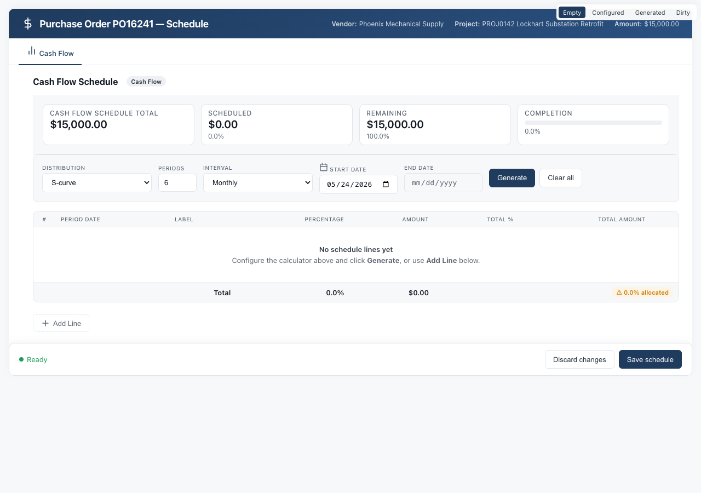

### The calculator toolbar

Across the top of the Cash Flow subtab is a row of controls. They do not change anything until you press **Generate**. Think of them as a recipe you're composing.

- **Distribution.** The shape of the spread:
  - *S-curve* (default): slow start, ramped middle, tapered tail. Matches how most construction phases actually consume budget.
  - *Linear*: even spread across every period. Good for steady-state recurring costs like rentals.
  - *Front-loaded*: heavier in the early periods. Mobilization, deposits, materials buys.
  - *Back-loaded*: heavier in the later periods. Final installs, closeout, retainage release.
- **Periods.** How many time buckets to split the total into.
- **Interval.** *Monthly*, *Bi-weekly*, or *Weekly*. Combined with Periods, this determines how far out the schedule runs.
- **Start date.** The first period's date.
- **End date.** Read-only; the editor computes it from Start + Periods + Interval.

As you change any input, a **live preview** below the toolbar updates: a mini bar chart showing the shape, plus a five-row table snippet showing the first few periods with dates, percents, and amounts. Nothing is written to the document yet.

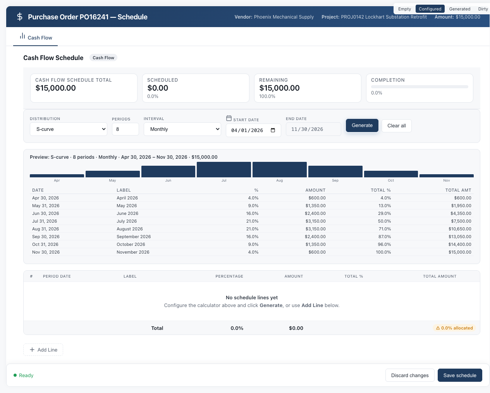

### Generating the grid

When the preview looks right, press **Generate**. The grid below the toolbar fills with one row per period. Each row shows the period date, a percent, an amount, a running total percent, and a running total amount.

If the grid already has unsaved edits, Generate confirms first before replacing them.

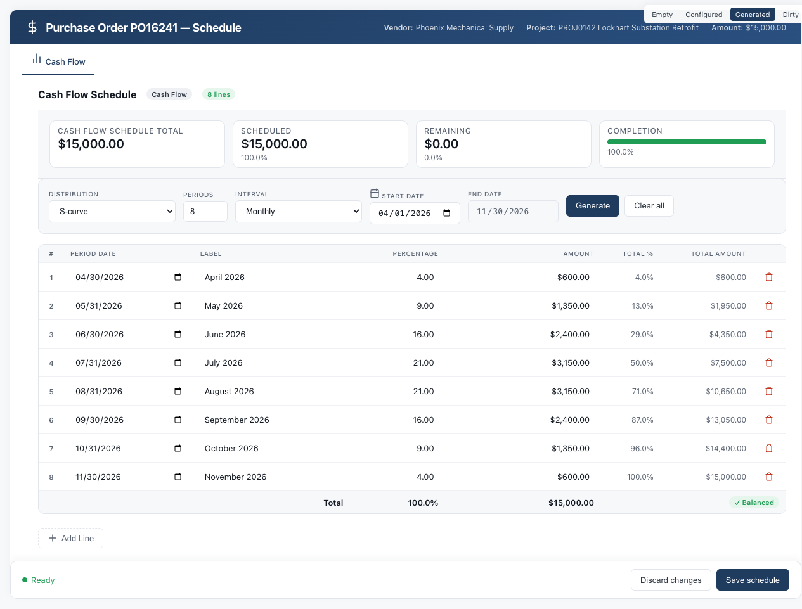

### Hand-editing rows

Generate gets you 90% of the way there. The grid is then a working surface. Type into any percent or amount cell to refine.

- Edit the **percent** column directly and the amount column recomputes.
- Edit the **amount** column directly and the percent column recomputes. Both directions route through the same math, so totals stay consistent either way.
- The **totals row** at the bottom updates after every edit.

### The validation badge

In the totals row, a colored pill tells you whether your schedule adds up:

- **Green "Balanced".** The rows sum to 100% (and to the document's contract amount). You're good to save.
- **Amber "X% allocated".** You're over or under 100%. The badge shows where you stand (for example, "97% allocated" or "104% allocated").

The badge is live. It changes on every keystroke.

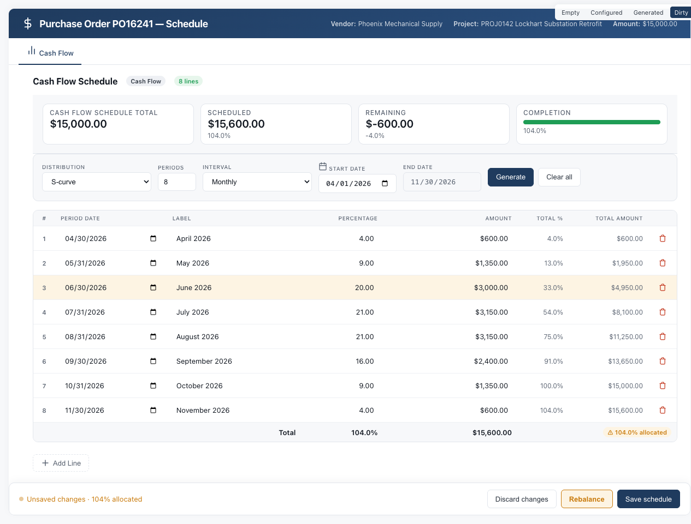

### Rebalance

When you go off-target, a **Rebalance** button appears next to Save. It distributes the overage or shortage proportionally across the rows you did *not* most recently edit, so your manual adjustment is preserved and the rest of the schedule absorbs the difference. Hover the button to see a tooltip with the exact amount, percent, and number of lines that will be touched.

You can also rebalance manually by hand-editing more rows. Rebalance is just a convenience.

### The save bar

Pinned to the bottom of the Cash Flow subtab is the save bar. It has three states, signaled by a colored dot:

- **Green dot, "Saved".** Your changes are persisted.
- **Pulsing slate dot, "Unsaved changes".** You have edits and the totals are balanced. Safe to save.
- **Pulsing amber dot.** You have edits *and* the totals are off. You can still save, but the badge is warning you that the math doesn't add up.

The bar carries three buttons:

- **Discard changes.** Rolls back any unsaved edits to the last saved state.
- **Rebalance.** Appears only when the totals are off (same as the toolbar Rebalance).
- **Save schedules.** Persists everything to NetSuite. While the save AJAX runs, the grid rows flash skeleton placeholders so you have visual confirmation that the save is in flight.

### Sales Order schedules (the revenue side)

Open any Sales Order and you'll find the same Cash Flow subtab: Distribution, Periods, Interval, Generate, live preview, validation badge, Discard / Rebalance / Save schedules. The Cash Flow subtab on a Sales Order uses the same editor pictured above on the PO, so we're not re-showing the screenshots.

What changes is what the editor is allocating:

- The total the schedule must balance against is the **base contract value** of the SO. On the demo data that's $30,000 on SO0631. The Balanced badge turns green when your rows sum to that number.
- **The SO schedule covers base contract only.** It does not include Change Orders. When a Change Order is approved against the SO, the revenue side picks the CO up automatically; its timing comes from the Change Request's own schedule, not the SO's.
- That's why the Revenue report on the project record shows **Base Contract** and **Change Orders** as separate KPI sublines. The Revenue report aggregates both, but the SO schedule editor only governs the first.

The same shape choices apply, but the levers usually pull in the opposite direction from the PO side:

- **Front-load** the base contract when retention milestones drive billing forward (a mobilization payment, an early progress draw).
- **Back-load** when retention sits at the end and the bulk of the contract is released on closeout.
- **S-curve** matches the typical billing rhythm for a phased install: slow start, fat middle, taper.

### Change Request schedules (one record, two schedules)

Change Orders are the most interesting case. Every approved Change Request can carry its **own** schedule, and in fact carries two of them, one on each side of the ledger.

- **Contract.** When the customer will be billed for the change.
- **Estimate.** What executing the change is forecasted to cost.

The CR Cash Flow subtab presents both behind a single **Contract / Estimate pill toggle** in the header. Contract is the navy theme (matches Revenue elsewhere), Estimate is the coral theme (matches Cost elsewhere). Clicking either button swaps which schedule is visible. Both schedules are saved together when you press Save schedules, regardless of which pane is showing. This replaced the older stacked dual-pane layout in the v1 redesign: same data, one pane on screen at a time.

The toggle buttons also show each side's total in their label, like `Contract ($12,000)` next to `Estimate ($10,000)`, so you can see the markup at a glance without flipping panes.

The reason this matters is that the two sides do not have to move together. A single CO might be:

- A *fast* Contract schedule (customer paid in month one as a deposit)
- A *slow* Estimate schedule (work spread across four months as you actually execute)

That timing mismatch (collecting fast and spending slow, or the reverse) is exactly the kind of working-capital signal a cash flow forecast exists to surface. The CR editor is where you express it.

### Where CR schedules show up downstream

Once a Change Request is saved with both Contract and Estimate schedules, its lines flow into the per-project reports:

- **Cost report.** The Estimate side appears as one or more `CO:` labeled rows in the source table.
- **Revenue report.** The Contract side appears as `CO:` labeled rows in its source table, and its total feeds the Change Orders KPI subline.
- **Combined report.** Both sides appear as separate `CO:` sub-rows, each routed to the correct group (Revenue or Cost).

The `CO:` prefix is how you tell at a glance, in any table on any report, that a row originated from a Change Request rather than a base PO or SO.

### One editor, three documents

| Surface | Total to allocate | Special UI |
|---|---|---|
| **Purchase Order → Schedule** | PO amount | (none, base editor) |
| **Sales Order → Schedule** | SO base contract value | Covers base only; COs flow in separately |
| **Change Request → Schedule** | Both Contract and Estimate totals | Contract / Estimate pill toggle in header |

One mental model, three places it shows up.

---

## 3. Reading a single project's cash flow

Once your schedules are saved, every BC Project record carries a **Cash Flow** parent subtab with three children: **Combined**, **Cost**, and **Revenue**. Same project, three angles.

Each child is a self-contained report embedded directly in the project record. The KPI strip, chart, and source-grouped table on each report all read from the same underlying timing data. They just show different cuts of it.

### Combined

The headline view. Open this first when you're checking in on a project.

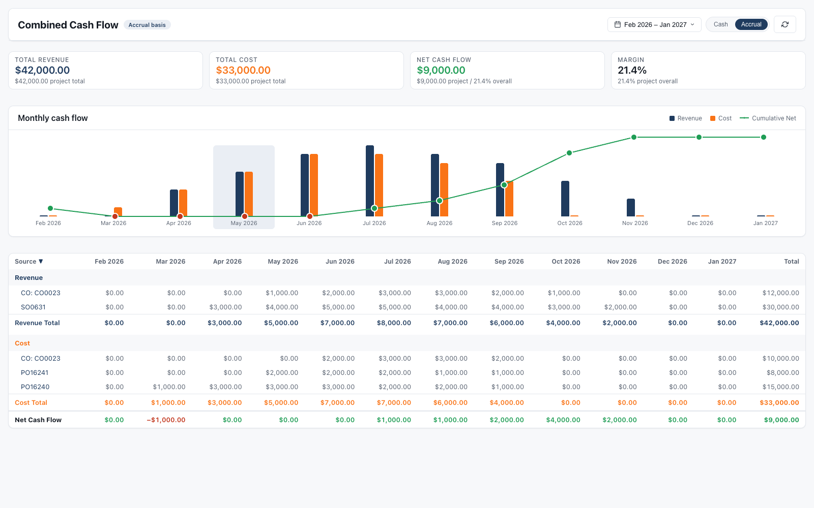

- **KPI strip.** Total Revenue, Total Cost, Net Cash Flow, and Margin for the active date range. Each card's subline shows the project total (across all time), so the range value sits in context.
- **Chart.** Paired bars per period: navy for revenue, coral-orange for cost. A green polyline overlays the bars and traces the cumulative net through time, with each dot colored by the sign of the running balance.
- **Hover tooltips.** Every bar and every trend dot exposes its exact value on hover. Combined has three independent hover surfaces per period: revenue bar, cost bar, trend dot. Hover slowly.
- **Source table.** One group per source document (SO0631, PO16240, CO-001), with sub-rows per transaction. Each source row's label is a link to that document. Clicking opens the SO or PO in NetSuite at the top frame, escaping the iframe.

### Cost

Same shape as Combined, but cost-only.

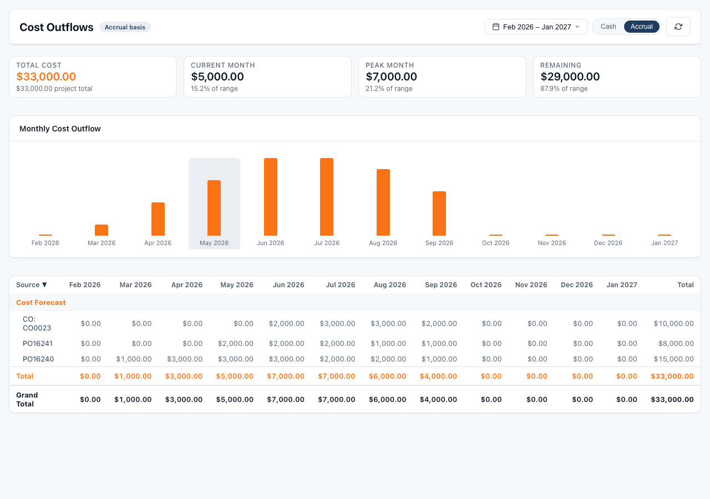

The bars are orange, the KPIs focus on cost (Total Cost in range, Project Total Cost, Active Sources, Periods in range), and the source table lists only your cost documents: POs and the cost legs of change orders.

### Revenue

Same shape, revenue-only.

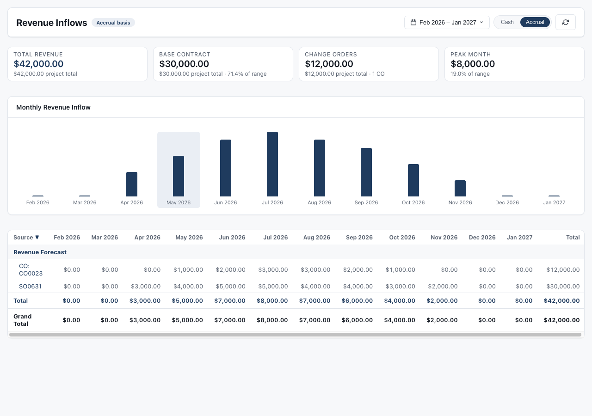

The Revenue KPIs add one detail the Combined view does not surface: **Base Contract** and **Change Orders** as separate line items. This is where you can see contract drift, how much of the current forecast is the original SO versus signed change orders on top.

### Controls (all three reports)

These work identically across Combined, Cost, and Revenue:

- **Cash / Accrual toggle.** Flip the timing basis. The data re-fetches.
- **Date range picker.** The pill in the top-right. Click it to open a panel with four preset chips (8, 12, 18, 24 months centered on the current month) and custom From / To `<input type="month">` fields. The range is capped at 24 months. Apply preserves your active mode, the URL updates, and the view reloads against the new range.
- **Refresh.** Pulls the latest data. The KPI cards, chart, and table briefly flash a skeleton-shimmer state so you have visual confirmation that the fetch fired.
- **Sortable columns.** Click any column header to sort.
  - The *Source* column has a 2-state toggle: descending (▼) and ascending (▲).
  - The *Period* and *Total* columns have a 3-state toggle: descending, ascending, then back to the default chronological order.
  - Sort state is held in memory. It survives mode flips and refresh, and resets when you Apply a new date range.

### What each report is for

- **Combined** answers *is this project making money over the next six months?*
- **Cost** answers *where is my cash going and to which vendors?*
- **Revenue** answers *what is my contract really worth and how much of it is change orders?*

A PM doing a weekly check-in usually lives in Combined. A controller chasing a billing question goes straight to Revenue. A PM watching burn on a tight job watches Cost.

---

## 4. Rolling up: the Portfolio view

The Portfolio Cash Flow Suitelet aggregates every active BC project into a single view. No PM wants to click into thirty project records to know what the company looks like next month. This is the place to start.

Open it from **BlueCollar → Project Control Center → Cash Flow Portfolio**.

### Two stories, one view

The same Portfolio surface tells two complementary stories depending on whether you have filters applied.

#### All projects

With no filters, the KPIs and chart sum across every active BC project. One set of numbers tells you the company's forecast.

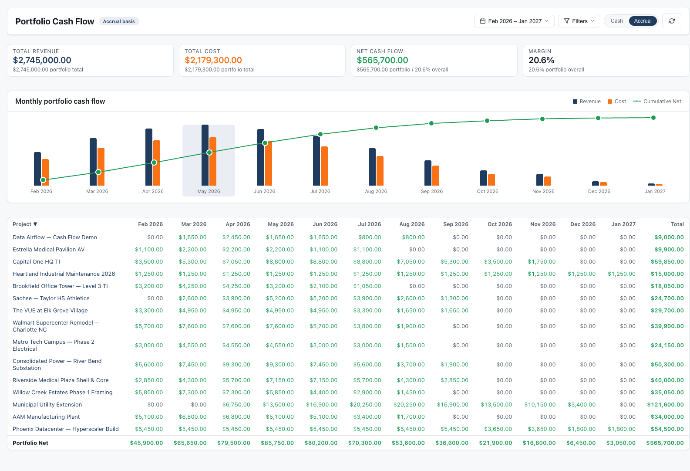

#### Filtered

Apply one or more filters and the KPIs narrow to just that slice. The sublines still show the portfolio total in the active date range, so you always see the slice in context: *"$553K from State DOT this year, against $2.7M portfolio."*

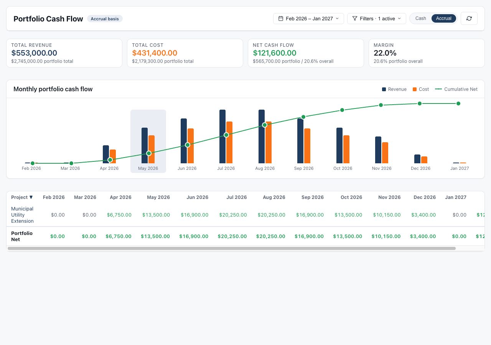

### The Filters pill

In the top-right header, next to the date range picker, is a **Filters** pill. Click it to open one panel that contains everything:

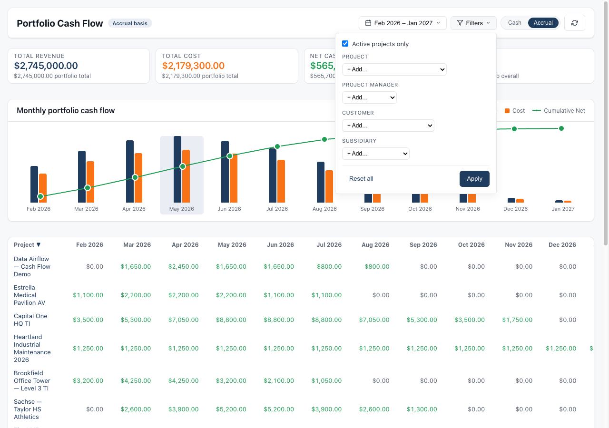

- **Active checkbox.** At the top of the panel. On by default; active projects only. Uncheck to include inactive projects too.
- **Project.** Multi-select. Add projects as chips.
- **Project Manager.** Multi-select.
- **Customer.** Multi-select.
- **Subsidiary.** Multi-select.

Each picker is a dropdown of the entities that actually have timing data, so you don't have to wade through every record in the company. Pick one or more, they become chips, and chips can be removed individually.

All four dimensions plus the Active checkbox AND together. A filter for `Customer = State DOT` and `PM = Jane Doe` shows projects matching both.

The panel footer has **Reset all** and **Apply**. Apply rebuilds the URL and the view reloads against the narrowed set.

### The portfolio table

One row per project. The columns are: project name, then one cell per month in the active date range, then a total cell.

- Each **period cell** shows the NET cash flow for that project in that month (revenue minus cost), colored green if positive and red if negative.
- The **project name** is a link to that BC Project record. Clicking opens the project in NetSuite at the top frame.
- The **default sort** is chronological by project creation date, newest first.
- **Sort headers** work the same as on the per-project reports: 2-state on Project, 3-state on Period and Total columns.
- A **Portfolio Net** row sits in the table footer, summing every column.

### What the Portfolio view is for

- An executive Monday morning: *"What does the next quarter look like for us?"* Open the view, no filters, eyes on the chart and the Net Cash Flow KPI.
- A controller answering an accounting question: *"How much are we forecasting for Subsidiary XYZ next month?"* Open, filter Subsidiary, read the KPI.
- A regional leader: *"Which of Jane's projects are bleeding cash in May?"* Filter PM to Jane, sort the May column ascending, look at the red cells at the top.

The Portfolio is the entry point. Once you've spotted a project that needs attention, click the project name and you're inside its Cash Flow subtab in two clicks.

---

## 5. The Cash vs Accrual model

Every report surface has a Cash / Accrual basis toggle. The two bases share the same underlying timing-line data; the toggle just changes which timing column the query pulls.

- **Cash basis.** When cash physically moves. The receipt date for revenue, the payment date for cost. This is the view your bank account sees. Use it when you're managing liquidity or coordinating with treasury.
- **Accrual basis.** When revenue is earned or cost is incurred. The recognition date. This is the view your P&L sees. Use it for financial reporting, margin analysis, or when you care about the *operational* shape of the work rather than its cash mechanics.

The two bases will diverge whenever there's a meaningful gap between when work happens and when money moves, which is essentially all of construction. Net 30 terms, retainage held until closeout, deposits up front, progress billings invoiced after the period closed: every one of those is a place Cash and Accrual will tell a slightly different story.

### Persistence

Your basis choice is part of the URL. It survives:

- Page refresh
- Refresh button clicks
- Date range Apply
- Mode-toggle clicks (the URL updates via `history.replaceState`, so your address bar always reflects the current state)

---

## 6. Tips and common patterns

### Drill into source transactions

The drill-in gesture is the single most useful muscle to learn. Every report surface is wired so the labels in the left-hand column take you to the document the number came from.

- In the **Combined**, **Cost**, and **Revenue** report tables, every sub-row's label is a clickable link.
  - Click `SO0631` to open that Sales Order at the top frame.
  - Click `PO16241` to open the Purchase Order.
  - Click `CO: CO0023` to open the Change Request behind that change order.
- In the **Portfolio** table, the project name in each row is the drill-in target. It opens the BC Project record.
- All of these links use `target="_top"`, so they escape the NetSuite subtab iframe cleanly. Your browser's Back button returns you to exactly where you started: same range, same basis, same scroll position.

The pattern is consistent: portfolio, project, source document, all by clicking left-column labels. Two hops from the company total to the actual purchase order line driving an inflection.

### Sorting columns

Every column header in every report table is sortable. Click once and the column sorts. The header shows a direction arrow: ▼ for descending (highest first), ▲ for ascending (lowest first).

The columns fall into two groups with different click behaviors:

- **Period columns and the Total column** cycle through **three** states: ▼ desc, ▲ asc, then reset to the table's default sort. The reset state has no arrow.
- The **Source column** (on per-project reports) and the **Project column** (on Portfolio) cycle through **two** states: ▼ and ▲. They have no reset state because that column *is* the default sort. There's nothing to reset to.

A few mechanics worth knowing:

- **Sort is client-side.** No server round trip. It's instant on every click.
- **Sort state survives the Cash / Accrual toggle and the Refresh button.** Flip basis and your sort sticks.
- **Sort state resets when you Apply a new date range**, because the column set itself changes. Old period columns may not exist in the new range.

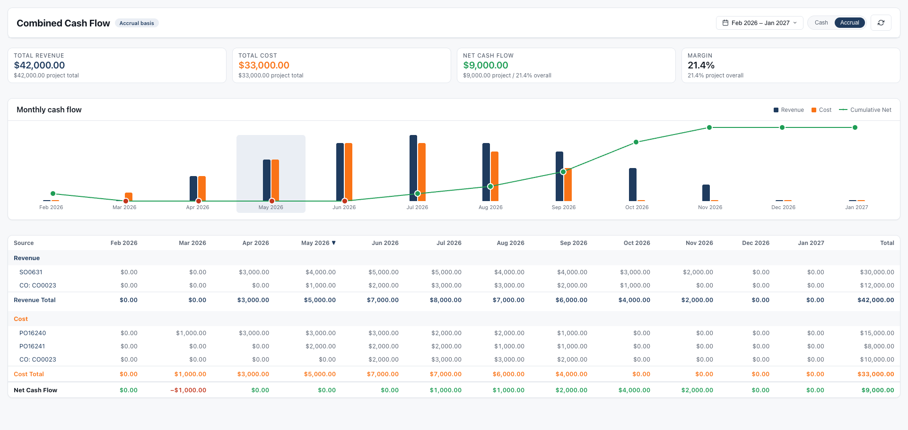

A common move: in the Portfolio view, sort the column for *next month* ascending. The deepest-red (most negative net) projects float to the top. That's your week.

### Period columns: what they tell you

Each period column header is a month label like "May 2026". A few details to notice:

- **Current month halo.** The current month always shows a soft brand-color halo behind both its bar in the chart and its column header in the table. No matter what range you pick, "now" is easy to find.
- **Empty months render as $0.** A month with no activity is still drawn: a $0 bar in the chart, a $0 cell in the table. This is deliberate. It gives the chart a constant time rhythm, and it prevents months from silently disappearing when nothing is scheduled.
- **Hover for exact dollars.** Every bar in the chart exposes its precise value via tooltip on hover. The Combined chart has three independent hover surfaces per period: the revenue bar, the cost bar, and the cumulative-net trend dot above. Hover slowly to get the one you want.
- **Sub-row cells contribute to the period total.** In the table, each sub-row's cell shows that source's contribution to that month. Sum the sub-rows for any column and you'll get the bottom totals row's value for that period.

### Cash vs Accrual nuance

The basis toggle changes which underlying timing column the query reads. Both bases pull from the same set of timing-line records, just from different fields on those records. The toggle is not a re-classification; it's a re-projection.

The practical consequence is that a project can look very different depending on which basis you're in:

- On **Accrual** it may look flush. Revenue earned this month from work in progress.
- On **Cash** the same month may show a deep dip. Those receivables don't hit the bank until net 30 or until retainage clears.

That gap between Accrual flush and Cash dip *is* the working-capital gap. Flipping the toggle is the fastest way to see how much of one a project is carrying.

### Skeleton flash on refresh

Any refresh, mode flip, date-range Apply, or filter Apply briefly shows skeleton-shimmer placeholders in the KPI cards, chart, and table. That's normal. It confirms the fetch fired. If you click Refresh and nothing flashes, the data did not refresh.

### Empty-state behaviors

A few cases worth knowing:

- **No projects match a filter combination.** The Portfolio table shows `No projects match these filters.` and the Filters pill stays open so you can adjust without clicking back in.
- **A project has no timing yet.** A BC project with no PO schedules and no SO schedule won't appear in the Portfolio rollup until at least one schedule exists. Create a schedule on the SO or any PO and the project shows up on the next refresh.
- **A date range with no activity.** All-$0 months render as a flat chart. Not an error state, just an honest read of the timing lines in that window.

### When numbers don't match what you expect

If a report's totals don't match what you think they should:

1. Check the **basis toggle**. Cash and Accrual will differ.
2. Check the **date range**. The KPI headline is the sum *in range*; the subline is the project total *across all time*.
3. Check the **Active checkbox** on Portfolio. By default, inactive projects are excluded.
4. **Refresh**. Confirm you're looking at the latest data, not a stale render.
5. Check the **sort state**. If you sorted on a period column, the order in the table won't match the chart's chronological order. That's not a discrepancy; it's expected.

If the numbers still look off, the source of truth is the Cash Flow subtab on each contributing document. Open the SO, PO, or CR, verify the schedule, and confirm the Balanced badge is green. Unsaved or off-target schedules will not be reflected in the forecast.

---

Three editors and two report views, designed to feel like one product. The same color encoding, the same hover behavior, the same date picker, the same Cash/Accrual toggle, the same drill-down gesture. Once you've used any one of them, you've effectively used all of them.
